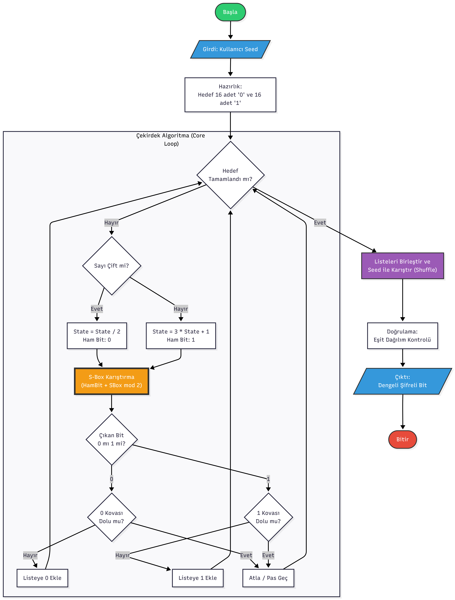

# Collatz Cipher Generator 🎲

**Collatz Sanısı (3n+1)** ve kriptografik **S-Box** kullanarak dengeli rastgele bit dizileri üreten Python projesi.

## 📐 Algoritma Akış Diyagramı



## 🔧 Çalışma Mantığı

### 1. **Başlangıç**
Kullanıcıdan bir `seed` (tohum) değeri alınır. Bu değer, tüm işlemlerin deterministik olmasını sağlar (aynı seed → aynı çıktı).

### 2. **Çekirdek Algoritma (Core Loop)**
- **Collatz Kuralı**: Sayı çift ise 2'ye böl (bit: 0), tek ise 3n+1 yap (bit: 1)
- **S-Box Karıştırma**: Ham bit, S-Box tablosu ile harmanlanarak doğrusallık bozulur
- **Kova Sistemi**: 0 ve 1'ler ayrı listelerde toplanır, her birinden tam 16 adet elde edilene kadar döngü devam eder

### 3. **Final Karıştırma**
Toplanan 16 adet 0 ve 16 adet 1, seed'e bağlı deterministik shuffle ile karıştırılır. Böylece sıralı görünüm ortadan kalkar ve homojen dağılım sağlanır.

### 4. **Çıktı**
32 bitlik dengeli (%50-0, %50-1) şifreli dizi hem string hem liste formatında gösterilir.

## 🚀 Özellikler

- ✅ **Mükemmel Denge**: Her zaman eşit sayıda 0 ve 1
- 🔐 **Kriptografik Katman**: S-Box ile lineerlik kırılması
- 🎯 **Deterministik**: Aynı seed, aynı sonuç (test edilebilir)
- ⚡ **Collatz Kaosu**: Tahmin edilemez sayı üretimi

## 📦 Kurulum ve Çalıştırma

Python yüklü olması yeterlidir. Terminal'de:

```bash
python shufflebucket.py
```

Program sizden bir **seed** (tohum sayısı) isteyecektir. Herhangi bir tam sayı girebilirsiniz.

## 📊 Örnek Çıktı - (Taslak Anahtar Değeri Sonucu)

```
--- S-BOX DUYARLI & DENGELİ BİT ÜRETECİ ---
Başlangıç Tohumu (Seed) giriniz: 1923

Hedef: 32 bit (%50 - %50 dağılım)...

==================================================
SONUÇ: ŞİFRELİ BİT DİZİSİ
==================================================

>> ÇIKTI (String): 11000100110001010111001001101101

>> ÇIKTI (Liste) : [1, 1, 0, 0, 0, 1, 0, 0, 1, 1, 0, 0, 0, 1, 0, 1, 0, 1, 1, 1, 0, 0, 1, 0, 0, 1, 1, 0, 1, 1, 0, 1]

--------------------------------------------------
DURUM   : ✅ BAŞARILI (0:16, 1:16)
==================================================
```

## 📊 Örnek Çıktı - (Orijinal Anahtar Değeri Sonucu)
```
--- S-BOX DUYARLI & DENGELİ BİT ÜRETECİ ---
Başlangıç Tohumu (Seed) giriniz: 1923

Hedef: 32 bit (%50 - %50 dağılım)...

==================================================
SONUÇ: ŞİFRELİ BİT DİZİSİ
==================================================

>> ÇIKTI (String): 01111100000111010110000011100110

>> ÇIKTI (Liste) : [0, 1, 1, 1, 1, 1, 0, 0, 0, 0, 0, 1, 1, 1, 0, 1, 0, 1, 1, 0, 0, 0, 0, 0, 1, 1, 1, 0, 0, 1, 1, 0]

--------------------------------------------------
DURUM   : ✅ BAŞARILI (0:16, 1:16)
==================================================
```

## 🏆 Challenge (Meydan Okuma)

Kodun içinde gördüğünüz S-Box (`[12, 5, 6...]`) sadece örnektir. 
Aşağıdaki şifreli metni, **farklı ve gizli bir S-Box** kullanarak ürettim.

**Hedef:** Algoritmanın mantığını kullanarak, aşağıdaki çıktıyı üreten `Seed` değerini veya `S-Box` dizilimini bulmaya çalışın.

**Şifreli Metin:** `11010010111...` (Buraya kendi gizli çıktını yapıştır)

## 🧪 Kullanım Alanları

- Kriptografik araştırmalar
- Rastgele sayı üreteci (PRNG/CSPRNG) analizi
- Matematiksel kaos teorisi deneyleri
- Eğitim ve öğretim amaçlı şifreleme örnekleri

---

**Not**: Bu proje eğitim amaçlıdır. Gerçek ürün ortamlarında endüstri standardı kriptografik kütüphaneler kullanılmalıdır.
